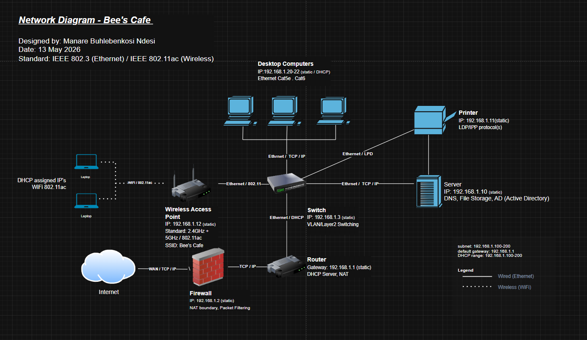

# Bee's Café — SME Network Design & Migration Project

> **IT Support Portfolio | Manare Ndesi | May 2026**

---

## Case Study

Bee's Café is a local small business that had been running its daily operations entirely on a manual book-based system — order tracking, inventory, and customer records all managed by hand.

The business owner approached me to assist with a full operational upgrade. This involved two parallel workstreams:

1. **Software migration** — I designed and deployed a small-scale custom application to replace the manual book system, handling orders, stock tracking, and basic reporting digitally.
2. **Network setup** — To support the new application and a private data and operations server the business had acquired, a proper local area network needed to be designed and implemented from scratch.

The owner had no technical background. Every decision made in this network design prioritised reliability, simplicity, and ease of management for a non-technical user. The network needed to support wired workstations for staff, a private server for business data, a shared network printer, and wireless access for management use... all within a small office environment.

The SME network diagram below represents the physical and logical structure of the network as designed and implemented.

---

## Network Diagram

---

## Network Topology

| Property | Detail |
|---|---|
| Topology | Star |
| Network Type | LAN (Local Area Network) |
| Subnet | 192.168.1.0/24 |
| Subnet Mask | 255.255.255.0 |
| Default Gateway | 192.168.1.1 |
| DHCP Range | 192.168.1.100 – 192.168.1.200 |
| Wireless Standard | IEEE 802.11ac |
| Wired Standard | IEEE 802.3 Ethernet (Cat5e/Cat6) |

---

## Devices & IP Scheme

| Device | IP Address | Assignment | Role |
|---|---|---|---|
| Router | 192.168.1.1 | Static | Default gateway, DHCP server, NAT |
| Firewall | 192.168.1.2 | Static | Perimeter security, packet filtering |
| Switch | 192.168.1.3 | Static | Layer 2 distribution, LAN backbone |
| Server | 192.168.1.10 | Static | Business data, application hosting, ops |
| Printer | 192.168.1.11 | Static | Shared network printing for all staff |
| Wireless Access Point | 192.168.1.12 | Static | WiFi coverage for wireless devices |
| Desktop PC 1 | 192.168.1.20 | Static | Staff workstation |
| Desktop PC 2 | 192.168.1.21 | Static | Staff workstation |
| Desktop PC 3 | 192.168.1.22 | Static | Staff workstation |
| Laptop 1 | 192.168.1.101 | DHCP | Management / mobile use |
| Laptop 2 | 192.168.1.102 | DHCP | Management / mobile use |

---

## Protocols Used

| Connection | Protocol | Notes |
|---|---|---|
| Internet → Firewall | WAN / TCP/IP | External traffic entry point |
| Firewall → Router | TCP/IP | Filtered traffic passed to internal network |
| Router → Switch | Ethernet / DHCP | Router distributes IPs to LAN devices |
| Switch → Desktop PCs | Ethernet / TCP/IP | Wired workstation connectivity |
| Switch → Server | Ethernet / TCP/IP | Private server access across LAN |
| Switch → Printer | Ethernet / LPD / IPP | Network print protocol |
| Switch → WAP | Ethernet / 802.11 | Wired uplink to access point |
| WAP → Laptops | WiFi 802.11ac | Wireless client connectivity |

---

## Design Decisions

**Firewall at the network edge:**

The firewall sits between the ISP connection and the internal router. All inbound and outbound traffic passes through it before reaching any internal device. For a business handling private customer and operations data, perimeter filtering was non-negotiable even at small scale.

**Static IPs for all infrastructure devices:**

The server, printer, firewall, WAP and switch are all assigned static (fixed) IP addresses. This ensures that dependent services — such as staff printing to a known printer IP, or the application connecting to a known server IP — never break due to an address change. DHCP is reserved for end-user devices only.

**DHCP for wireless/mobile devices:**

Laptops used for management purposes are assigned IPs automatically from the DHCP pool (192.168.1.100–200). This simplifies onboarding without requiring manual configuration every time a device connects.

**Central switch as distribution layer:**

All wired devices connect to a single managed switch rather than directly to the router. This offloads traffic management from the router, reduces congestion, and allows the network to scale — additional devices or a second switch can be added without redesigning the core.

**WAP connected via wired uplink:**

The wireless access point receives its connection from the switch via ethernet cable. This ensures stable, high-throughput connectivity to wireless clients. A wireless backhaul (WAP connecting wirelessly to the router) was avoided as it halves available bandwidth and introduces instability — unacceptable in a working business environment.

**Server on the internal LAN, not exposed to internet:**

The business data and operations server sits entirely within the private 192.168.1.0/24 subnet with no direct external access. Access from outside the premises would require a VPN — a deliberate security decision to protect business-critical data.

---

## Tools Used

| Tool | Purpose |
|---|---|
| draw.io | Network diagram design |
| CompTIA A+ Curriculum | Networking standards reference |
| IEEE 802.3 / 802.11ac | Wired and wireless protocol standards |

---

## Author

**Manare Ndesi** | manarendesi@gmail.com | www.linkedin.com/in/manare-ndesi

---

*Network design based on a real client engagement. Business name changed for confidentiality.*
